# TerziLLM

Terzi LLM is meant to be a frictionless entry into local, self owned AI. 

## Technical Overview

## Configuration 1: Desktop/Laptop & Mobile Interface
- 
A Progressive Web App for local LLM inference using WebLLM. The application supports two deployment modes:

- **Host Mode**: A desktop/laptop with GPU that loads the model and performs inference
- **Mobile Mode**: A lightweight PWA that connects to a host machine for inference

## Configuration 2: Server with Mobile Interface

A server-hosted application that performs inference on the server and serves a mobile-optimized frontend. This is a more traditional architecture that still allows users to self-host but offloads all computation to the server. It will use the same PWA codebase for ease of development and maintenance.

The target server provider is Vultr, which offers affordable GPU instances that can run the WebLLM engine. Vultr's marketplace also allows for easy deployment of pre-configured images, which can simplify the setup process for users who want to host their own LLM server. They have a Vultr WebApp that can run containerized applications, which could be an ideal way to deploy the server component of TerziLLM.


## Features

- 🧠 **Local LLM Inference** — Run models entirely in-browser via WebGPU
- 💾 **Persistent Chat History** — Conversations stored in IndexedDB
- 📱 **PWA Support** — Installable on desktop and mobile
- 🌐 **Remote Inference** — Mobile devices can offload inference to a host machine
- ⚡ **Streaming Responses** — Real-time token streaming for responsive UX

---

## Tech Stack

### Core Runtime

| Layer | Technology | Purpose |
|-------|------------|---------|
| **UI Framework** | React 19 + TypeScript | Component-based UI |
| **Build Tool** | Vite | Fast dev server & optimized builds |
| **Styling** | Tailwind CSS | Utility-first styling |
| **PWA** | `vite-plugin-pwa` | Service worker & manifest |

### AI & Inference

| Layer | Technology | Purpose |
|-------|------------|---------|
| **LLM Runtime** | `@mlc-ai/web-llm` | WebGPU-accelerated inference |
| **AI SDK** | Vercel AI SDK (`ai`) | Chat hooks & streaming utilities |
| **State Management** | Zustand | Global state (inference mode, connection, UI) |
| **Persistence** | `idb` (IndexedDB wrapper) | Chat history storage |
| **Host↔Mobile** | WebSocket / WebRTC | Remote inference bridge |

### Development & Testing

| Layer | Technology | Purpose |
|-------|------------|---------|
| **Testing Framework** | Vitest + v8 coverage | Unit & integration tests |
| **E2E Testing** | Playwright | Full user flow testing |
| **Console Capture** | `cons2term` | Stream browser console to VS Code terminal |

> **Note:** `cons2term` is a dev-only dependency that captures console output and streams it to the VS Code terminal. This allows GitHub Copilot to see runtime logs for better code suggestions.

---

## Architecture Overview

### High-Level System Design

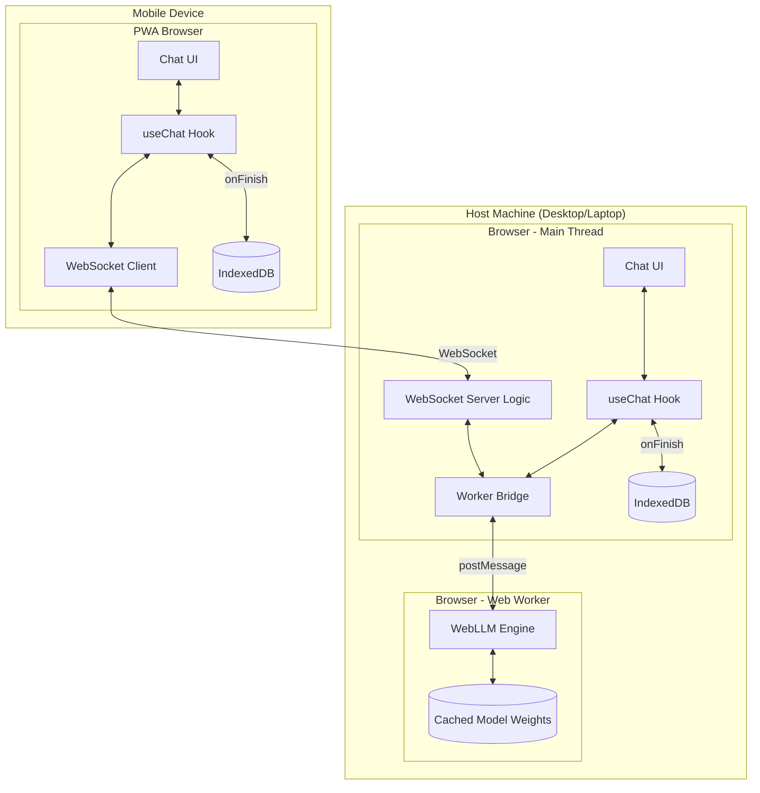

---

## Detailed Component Design

### 1. Web Worker Bridge (Local Inference)

The bridge connects the main thread to the WebLLM engine running in a Web Worker. This keeps the UI responsive during inference.

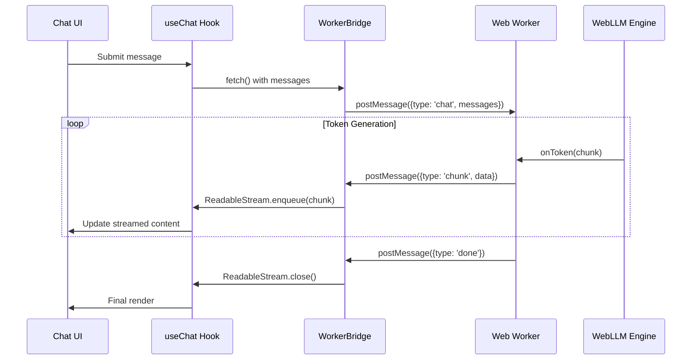

#### WorkerBridge Class

The `WorkerBridge` creates a fetch-compatible interface that wraps Web Worker communication:

```typescript
// Conceptual API
class WorkerBridge {
  private worker: Worker;
  
  async chat(messages: Message[]): Promise<ReadableStream> {
    return new ReadableStream({
      start: (controller) => {
        this.worker.onmessage = (e) => {
          if (e.data.type === 'chunk') {
            controller.enqueue(e.data.content);
          } else if (e.data.type === 'done') {
            controller.close();
          } else if (e.data.type === 'error') {
            controller.error(e.data.error);
          }
        };
        this.worker.postMessage({ type: 'chat', messages });
      }
    });
  }
}
```

---

### 2. Web Worker Implementation

The Web Worker initializes the WebLLM engine and handles inference requests.

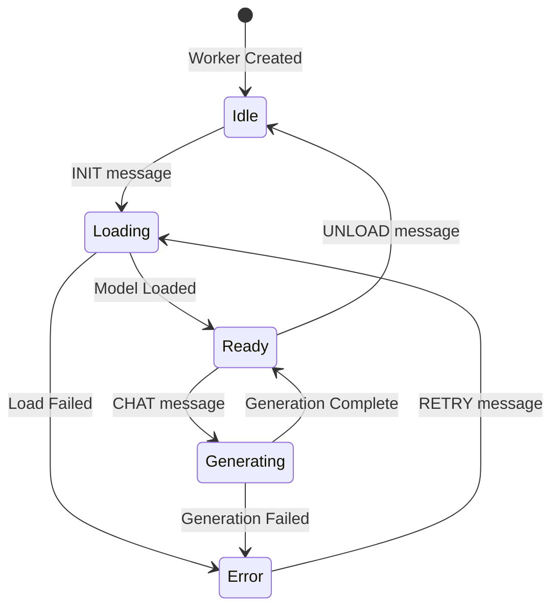

#### Worker Message Protocol

| Message Type | Direction | Payload | Description |
|--------------|-----------|---------|-------------|
| `init` | Main → Worker | `{ model: string }` | Initialize engine with model ID |
| `init-progress` | Worker → Main | `{ progress: number, text: string }` | Model download/load progress |
| `init-complete` | Worker → Main | `{ success: boolean }` | Engine ready |
| `chat` | Main → Worker | `{ messages: Message[], config?: GenerateConfig }` | Start generation |
| `chunk` | Worker → Main | `{ content: string }` | Streamed token |
| `done` | Worker → Main | `{ usage?: TokenUsage }` | Generation complete |
| `error` | Worker → Main | `{ error: string, code: string }` | Error occurred |
| `abort` | Main → Worker | `{}` | Cancel current generation |

---

### 3. IndexedDB Persistence Layer

Chat history is stored locally using IndexedDB for offline access and persistence.

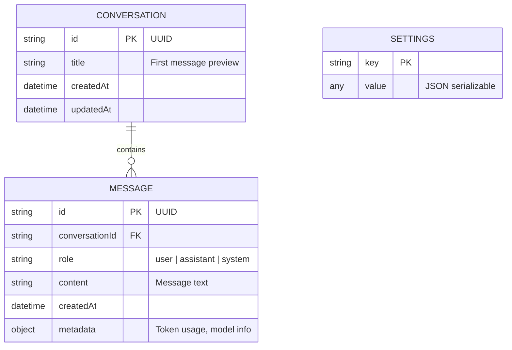

#### Database Operations

```typescript
// Conceptual API
interface ChatDatabase {
  // Conversations
  createConversation(): Promise<Conversation>;
  getConversation(id: string): Promise<Conversation | null>;
  listConversations(): Promise<Conversation[]>;
  deleteConversation(id: string): Promise<void>;
  
  // Messages
  addMessage(conversationId: string, message: Message): Promise<void>;
  getMessages(conversationId: string): Promise<Message[]>;
  
  // Settings
  getSetting<T>(key: string): Promise<T | null>;
  setSetting<T>(key: string, value: T): Promise<void>;
}
```

---

### 4. Host↔Mobile Communication (Remote Inference)

When running on a mobile device without sufficient GPU, the app connects to a host machine for inference.

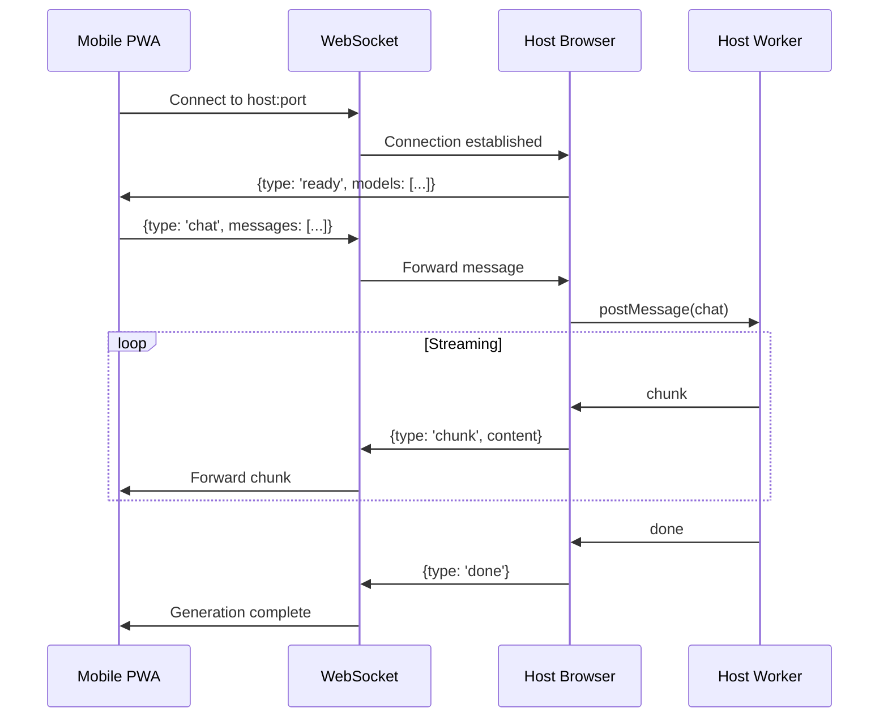

#### Connection States

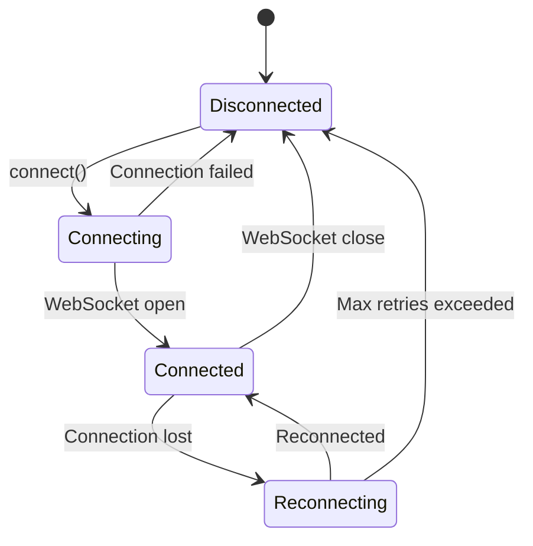

#### Remote Protocol Messages

| Message Type | Direction | Payload |
|--------------|-----------|---------|
| `ready` | Host → Mobile | `{ models: string[], status: 'idle' \| 'busy' }` |
| `chat` | Mobile → Host | `{ messages: Message[], model?: string }` |
| `chunk` | Host → Mobile | `{ content: string }` |
| `done` | Host → Mobile | `{ usage?: TokenUsage }` |
| `error` | Host → Mobile | `{ error: string }` |
| `abort` | Mobile → Host | `{}` |
| `ping/pong` | Bidirectional | `{}` (keepalive) |

---

### 5. Vercel AI SDK Integration

The `useChat` hook requires a custom fetch handler to work with local inference.

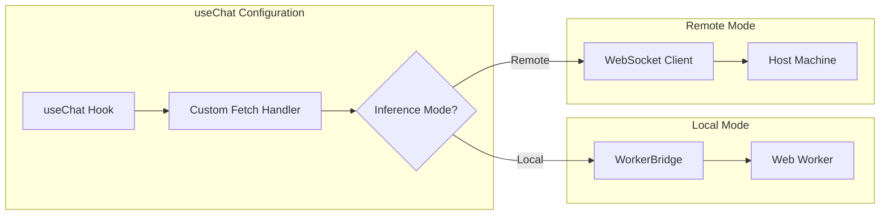

#### Custom Chat Provider

```typescript
// Conceptual integration with useChat
const { messages, input, handleSubmit } = useChat({
  api: '/api/chat', // Not used, overridden by fetch
  
  // Custom fetch replaces default behavior
  fetch: async (url, options) => {
    const body = JSON.parse(options.body);
    
    if (inferenceMode === 'local') {
      const stream = await workerBridge.chat(body.messages);
      return new Response(stream);
    } else {
      return wsClient.chat(body.messages);
    }
  },
  
  // Persist on completion
  onFinish: async (message) => {
    await db.addMessage(conversationId, message);
  }
});
```

---

## Proposed Project Structure

```
src/
├── components/
│   ├── chat/
│   │   ├── ChatContainer.tsx      # Main chat layout
│   │   ├── MessageList.tsx        # Scrollable message area
│   │   ├── MessageBubble.tsx      # Individual message
│   │   ├── ChatInput.tsx          # Input with submit
│   │   └── StreamingMarkdown.tsx  # Markdown renderer
│   ├── sidebar/
│   │   ├── Sidebar.tsx            # Conversation list
│   │   └── ConversationItem.tsx   # Single conversation
│   └── settings/
│       ├── SettingsModal.tsx      # Settings dialog
│       └── ModelSelector.tsx      # Model dropdown
├── hooks/
│   ├── useChat.ts                 # Extended useChat with local inference
│   ├── useWorkerBridge.ts         # Worker communication hook
│   ├── useRemoteInference.ts      # WebSocket client hook
│   └── useDatabase.ts             # IndexedDB operations
├── lib/
│   ├── worker-bridge.ts           # WorkerBridge class
│   ├── ws-client.ts               # WebSocket client
│   ├── database.ts                # IndexedDB schema & operations
│   └── utils.ts                   # Shared utilities
├── worker/
│   └── llm-worker.ts              # Web Worker entry point
├── types/
│   └── index.ts                   # Shared TypeScript types
├── App.tsx                        # Root component
└── main.tsx                       # Entry point
```

---

## Model Loading & Caching

WebLLM caches model weights in IndexedDB automatically. The loading flow:

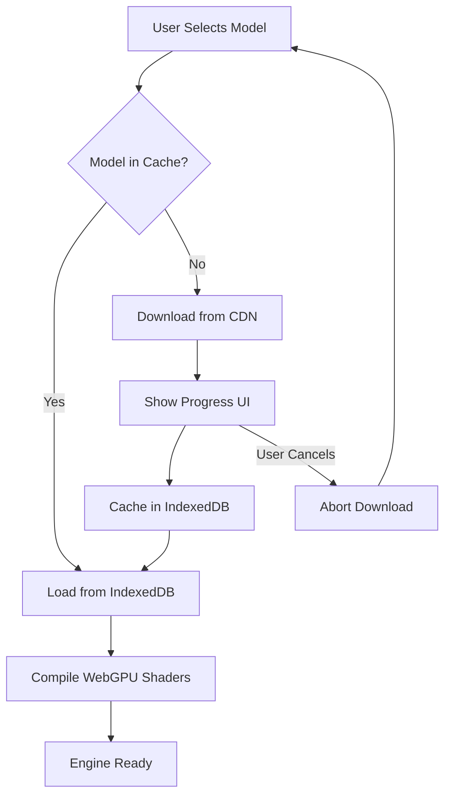

### Recommended Models

| Model | Size | Use Case |
|-------|------|----------|
| `Llama-3.2-1B-Instruct-q4f16_1-MLC` | ~700MB | Fast, lightweight responses |
| `Llama-3.2-3B-Instruct-q4f16_1-MLC` | ~1.8GB | Balanced quality/speed |
| `Phi-3.5-mini-instruct-q4f16_1-MLC` | ~2.1GB | Strong reasoning |
| `Qwen2.5-7B-Instruct-q4f16_1-MLC` | ~4.5GB | High quality (requires good GPU) |

---

## State Management & Hydration

Zustand manages global application state with IndexedDB persistence for offline support.

### Store Structure

```typescript
interface AppStore {
  // Inference
  inferenceMode: 'local' | 'remote';
  modelStatus: 'idle' | 'loading' | 'ready' | 'error';
  loadProgress: number;
  
  // Connection (remote mode)
  connectionStatus: 'disconnected' | 'connecting' | 'connected';
  hostUrl: string | null;
  
  // Conversations
  currentConversationId: string | null;
  conversations: Conversation[];
  
  // UI
  sidebarOpen: boolean;
  settingsOpen: boolean;
}
```

### Hydration Flow

On app startup, state is hydrated from IndexedDB:

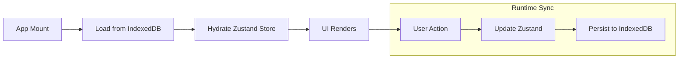

We use a custom `persist` middleware that:
1. Loads saved state from IndexedDB on mount
2. Debounces writes to avoid excessive IndexedDB operations
3. Handles migration when store schema changes

---

## Testing Strategy

### Test Pyramid

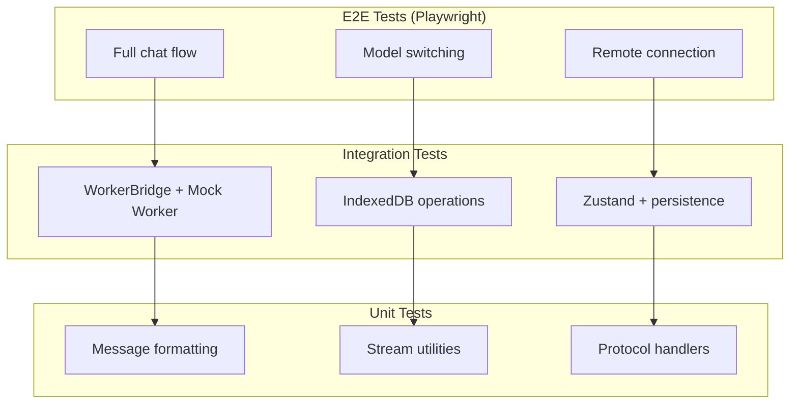

### Mocking Strategy

| Component | Mock Approach |
|-----------|---------------|
| **WebLLM Engine** | Mock `WorkerBridge` that returns canned responses |
| **Web Worker** | Use `vitest-webworker` or inline worker mocks |
| **IndexedDB** | `fake-indexeddb` for in-memory testing |
| **WebSocket** | `mock-socket` for connection testing |
| **WebGPU** | Skip in CI; run GPU tests locally or on dedicated runners |

### Test Commands

```bash
# Run unit & integration tests
npm run test

# Run with coverage
npm run test:coverage

# Run E2E tests (requires dev server)
npm run test:e2e

# Run E2E in headed mode for debugging
npm run test:e2e:headed
```

### CI Considerations

- **Unit/Integration tests**: Run on all PRs
- **E2E tests**: Run on `main` branch and release PRs
- **WebGPU tests**: Require self-hosted runners with GPU access (optional)

---

## Error Handling Strategy

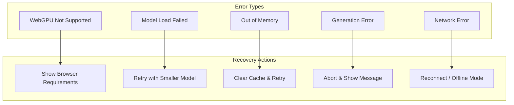

---

## Getting Started

### Prerequisites

- Node.js 20+
- Modern browser with WebGPU support (Chrome 113+, Edge 113+)
- GPU with at least 4GB VRAM (for local inference)

### Installation

```bash
# Install dependencies
npm install

# Start development server
npm run dev
```

### Building for Production

```bash
# Build optimized bundle
npm run build

# Preview production build
npm run preview
```

---

## Development Phases & Roadmap

### Phase 1 (Proof of Concept)
- [ ] Basic chat UI with streaming responses
- [ ] Support for 4 models - Mobile, Light, Medium, Heavy
- [ ] Conversation persistence in IndexedDB
- [ ] PWA manifest & basic offline support

### Phase 2 (Demo to Release)
- [ ] Model download progress UI
- [ ] Cached Models Display
- [ ] Remove Cached Model
- [ ] Error recovery flows

### Phase 3 (Crowdfunding Release)
- [ ] Host mode WebSocket server
- [ ] Mobile mode WebSocket client
- [ ] Connection status UI
- [ ] Automatic reconnection

### Phase 4 (Roadmap for Crowdfunding 'Buzz')
- [ ] Voice input/output
- [ ] Image understanding (multimodal models)
- [ ] Conversation branching
- [ ] RAG with local documents
- [ ] Conversation search
- [ ] Multi-model support (switch models mid-conversation)
- [ ] Github Copilot SDK integration for development AND AI assistant features

## Tasks & Issues

1. [ ] LLM Web Worker Implementation
